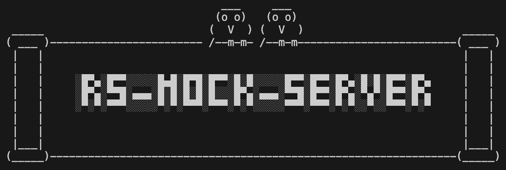

<p align="center">
  
</p>

# RS-MOCK-SERVER 🦀

A simple, zero-configuration mock server built in Rust. Spin up a realistic REST API for local development or testing just by creating folders and files.

It works by scanning a directory and mapping its structure directly to API routes, with clever filename conventions for handling HTTP methods, dynamic parameters, and static assets.

## Quick Start

### Installation

```bash
# Install from crates.io
cargo install rs-mock-server

# Or build from source
git clone https://github.com/lvendrame/rs-mock-server.git
cd rs-mock-server && cargo build --release
```

### Basic Usage

```bash
# Start server (uses ./mocks folder, port 4520)
rs-mock-server

# Custom port and folder
rs-mock-server --port 8080 --folder ./my-api-mocks
```

### Create Your First Endpoints

```bash
# Create mock directory structure
mkdir -p mocks/api/users

# Simple GET endpoint
echo '{"users": [{"id": 1, "name": "John"}]}' > mocks/api/users/get.json
# → GET /api/users

# Dynamic route with ID parameter
echo '{"id": 1, "name": "John", "email": "john@example.com"}' > mocks/api/users/get{id}.json
# → GET /api/users/123

# Full CRUD REST API
echo '[{"id": 1, "name": "John"}, {"id": 2, "name": "Jane"}]' > mocks/api/users/rest.json
# → GET, POST, PUT, PATCH, DELETE /api/users[/{id}]
```

### Core Filename Patterns

| Pattern               | Example           | Generated Route            | Description       |
| --------------------- | ----------------- | -------------------------- | ----------------- |
| `[method]`            | `get.json`        | `GET /api/users`           | Basic HTTP method |
| `[method]{id}`        | `get{id}.json`    | `GET /api/users/{id}`      | Dynamic parameter |
| `[method]{value}`     | `get{admin}.json` | `GET /api/users/admin`     | Specific value    |
| `[method]{start-end}` | `get{1-5}.json`   | `GET /api/users/1` to `/5` | Numeric range     |

## Features

-   🚀 **File-System Routing**: Your folder structure defines your API routes. No config files needed.
-   🧩 **Dynamic Path Generation**: Create routes with parameters (`{id}`), specific values (`{admin}`), and even numeric ranges (`{1-10}`) right from the filename.
-   ⚙️ **Full HTTP Method Support**: Define `GET`, `POST`, `PUT`, `DELETE`, `PATCH`, and `OPTIONS` endpoints.
-   🔗 **In-Memory REST API**: Create fully functional CRUD APIs with automatic ID generation and data persistence during runtime using special `rest.json` or `rest.jgd` files.
-   🔐 **JWT Authentication**: Automatic authentication system with login/logout endpoints and route protection using special `{auth}` files.
-   📤 **File Upload & Download**: Create upload endpoints with automatic file handling and download capabilities using special `{upload}` folders.
-   🖼️ **Static File Serving**: Automatically serves any file (like images, CSS, or JS) with its correct `Content-Type` if the filename doesn't match a method pattern.
-   📊 **JGD Support**: Generate dynamic JSON responses using JGD (JSON Generation Definition) files with the [JGD-rs library](https://github.com/lvendrame/jgd-rs/tree/main/jgd-rs) for realistic test data.
-   🌐 **Public Directory Serving**: Serve a directory of static files (e.g., a frontend build) from a root public folder, or map a folder like public-assets to a custom /assets route.
-   🔄 **Hot Reload**: Automatically restarts the server when files are added, modified, or deleted in the mock directory.
-   🌐 **Web Interface**: Access the root URL to get an interactive web interface for testing all your endpoints directly in the browser.
-   🔧 **Configurable**: Easily change the port and mock directory via command-line arguments.
-   ⚡ **Lightweight & Fast**: Built with Rust for minimal resource usage and maximum performance.
-   🗄️ **SQL Routes**: Use `.sql` files to create GET endpoints that execute SQL queries against the in-memory database and return results as JSON.
-   🗄️ **GraphQL**: Create your GraphQL queries and mutations, also load collections to load data.

---

## How It Works

The server recursively scans a root directory (defaults to `./mocks`) and translates the file and folder paths into API endpoints.

### Folder Structure → URL Path

The path of each folder becomes the base URL for the routes within it.

-   A folder at `./mocks/api/users` creates the base route `/api/users`.
-   A nested folder at `./mocks/api/users/profiles` creates the base route `/api/users/profiles`.

### Filename Conventions → Endpoints

The name of a file determines the **HTTP method** and the **final URL segment**. The content of the file is served as the response body.

The following table shows how different filename patterns are mapped to routes, assuming they are inside a `./mocks/api/users` directory:

| Filename Pattern      | Example File      | Generated Route(s)                                                                                                                             | Description                                                                                                                                                                       |
| :-------------------- | :---------------- | :--------------------------------------------------------------------------------------------------------------------------------------------- | :-------------------------------------------------------------------------------------------------------------------------------------------------------------------------------- |
| `[method]`            | `get.json`        | `GET /api/users`                                                                                                                               | Creates a route for a standard HTTP method.                                                                                                                                       |
| `[method]{id}`        | `get{id}.json`    | `GET /api/users/{id}`                                                                                                                          | A dynamic segment that accepts any value in that position.                                                                                                                        |
| `[method]{value}`     | `get{admin}.json` | `GET /api/users/admin`                                                                                                                         | Matches a specific, hardcoded value.                                                                                                                                              |
| `[method]{start-end}` | `get{1-5}.json`   | `GET /api/users/1`<br>`GET /api/users/2`<br>...<br>`GET /api/users/5`                                                                          | A numeric range that generates multiple distinct routes.                                                                                                                          |
| `rest[{params}]`      | `rest.json`       | `GET /api/users`<br>`POST /api/users`<br>`GET /api/users/{id}`<br>`PUT /api/users/{id}`<br>`PATCH /api/users/{id}`<br>`DELETE /api/users/{id}` | **In-Memory REST API**.<br>Creates a full CRUD API with automatic ID generation, data persistence,<br>and initial data loading from the JSON array in the file.                   |
| `rest[{params}]`      | `rest.jgd`        | `GET /api/users`<br>`POST /api/users`<br>`GET /api/users/{id}`<br>`PUT /api/users/{id}`<br>`PATCH /api/users/{id}`<br>`DELETE /api/users/{id}` | **In-Memory REST API with JGD**.<br>Creates a full CRUD API with dynamic fake data generation using JGD<br>as initial data, then maintains persistence during runtime.            |
| `{auth}`              | `{auth}.json`     | `POST /api/login`<br>`POST /api/logout`                                                                                                        | **JWT Authentication**. Creates login and logout endpoints with JWT token generation<br>and validation middleware for route protection.                                           |
| `[filename].[ext]`    | `avatar.png`      | `GET /api/users/avatar`                                                                                                                        | **Static File**. Any filename that doesn't match the patterns above is served as a static asset.<br>The `Content-Type` header is automatically set based on the file's extension. |
| `[filename].jgd`      | `users.jgd`       | `GET /api/users/users`                                                                                                                         | **JGD File**. JSON Generation Definition files that dynamically generate realistic JSON data<br>using the [JGD-rs library](https://github.com/lvendrame/jgd-rs/tree/main/jgd-rs). |

## Documentation

### 📚 Feature Guides

-   **[Basic Routing](docs/01-basic-routing.md)** - Learn filename patterns and route creation
-   **[REST APIs](docs/02-rest-apis.md)** - Build full CRUD APIs with persistence
-   **[Authentication](docs/03-authentication.md)** - JWT-based auth with route protection
-   **[File Uploads](docs/04-file-uploads.md)** - Handle file uploads and downloads
-   **[Static Files](docs/05-static-files.md)** - Serve assets with automatic Content-Type
-   **[JGD Files](docs/06-jgd-files.md)** - Generate dynamic JSON with realistic data
-   **[Web Interface](docs/07-web-interface.md)** - Interactive testing and management
-   **[Hot Reload](docs/08-hot-reload.md)** - Development workflow and file monitoring
-   **[SQL Routes](docs/09-sql-routes.md)** - Execute `.sql` files as GET endpoints against in-memory database
-   **[Configurations](docs/10-configurations.md)** - Create a `.toml` file to create specific configurations for your server and your routes
-   **[GraphQL](docs/11-graphql.md)** - Learn how to build GraphQL queries and mutations.

### 🚀 Quick Examples

**Simple API**

```bash
mkdir -p mocks/api
echo '{"status": "ok"}' > mocks/api/health.json
# → GET /api/health
```

**CRUD REST API**

```bash
echo '[{"id": 1, "name": "Product 1"}]' > mocks/products/rest.json
# → Full CRUD at /products/*
```

**Authentication**

```bash
echo '[{"username": "admin", "password": "secret"}]' > mocks/auth/{auth}.json
# → POST /auth/login, POST /auth/logout
```

**File Uploads**

```bash
mkdir mocks/{upload}
# → POST /upload, GET /upload, GET /upload/{filename}
```

## Example Structure

```
mocks/
├── api/
│   ├── users/
│   │   ├── get.json           # GET /api/users
│   │   ├── get{id}.json       # GET /api/users/{id}
│   │   └── post.json          # POST /api/users
│   └── products/
│       └── rest.json          # Full CRUD /api/products/*
├── auth/
│   └── {auth}.json            # Login/logout endpoints
├── {upload}/                  # File upload endpoints
└── assets/
    └── logo.png               # GET /assets/logo.png
```

**Generated Routes:**

-   `GET /api/users` - List users
-   `GET /api/users/123` - Get user by ID
-   `POST /api/users` - Create user
-   `GET,POST,PUT,DELETE /api/products/*` - Full REST API
-   `POST /auth/login` - User authentication
-   `POST /upload` - File uploads
-   `GET /assets/logo.png` - Static assets
-   `GET /` - Homepage

## CLI Options

```bash
rs-mock-server [OPTIONS]

Options:
  -p, --port <PORT>                      Port to run the server on [default: 4520]
  -f, --folder <FOLDER>                  Directory to load mock files from [default: mocks]
  -d, --disable-cors                     Disable CORS, by default CORS is enabled
  -a, --allowed-origin <ALLOWED_ORIGIN>  Allowed origin, by default all origins are allowed
  -h, --help                             Print help
  -V, --version                          Print version
```

---

## Development

### Getting Started

1. **Clone the repository**:

    ```bash
    git clone https://github.com/lvendrame/rs-mock-server.git
    cd rs-mock-server
    ```

2. **Install dependencies**:

    ```bash
    cargo build
    ```

3. **Set up development environment**:
    ```bash
    make dev-setup
    ```

### Development Commands

The project includes a Makefile with convenient development commands:

```bash
# Run tests
make test

# Run tests in watch mode (requires cargo-watch)
make test-watch

# Run all quality checks (tests, clippy, formatting)
make check-all

# Format code
make fmt

# Run Clippy linter
make clippy

# Build the project
make build

# Run the application
make run

# Set up Git hooks
make setup-hooks
```

### Pre-commit Hooks

This project uses Git pre-commit hooks to ensure code quality. The hooks automatically:

-   ✅ Run all tests before each commit
-   ❌ Block commits if tests fail
-   🎯 Ensure consistent code quality

**Automatic setup**: Pre-commit hooks are installed automatically when you run `make dev-setup` or `make setup-hooks`.

**Manual bypass** (not recommended): If you need to commit without running tests:

```bash
git commit --no-verify -m "Your message"
```

**Configuration**: You can customize the pre-commit checks by editing `.git/hooks/pre-commit`. The hook supports:

-   Running tests (enabled by default)
-   Running Clippy checks (disabled by default)
-   Checking code formatting (disabled by default)

### Testing

The project includes comprehensive test coverage:

```bash
# Run all tests
cargo test

# Run specific test module
cargo test id_manager
cargo test in_memory_collection
cargo test route_builder

# Run tests with output
cargo test -- --nocapture
```

### Contributing

1. Fork the repository
2. Create a feature branch: `git checkout -b feature-name`
3. Make your changes and ensure tests pass
4. Commit your changes (pre-commit hooks will run automatically)
5. Push to your fork and submit a pull request

**Code Quality**: All contributions must:

-   Pass existing tests
-   Include tests for new functionality
-   Follow Rust formatting standards (`cargo fmt`)
-   Pass Clippy linting (`cargo clippy`)
