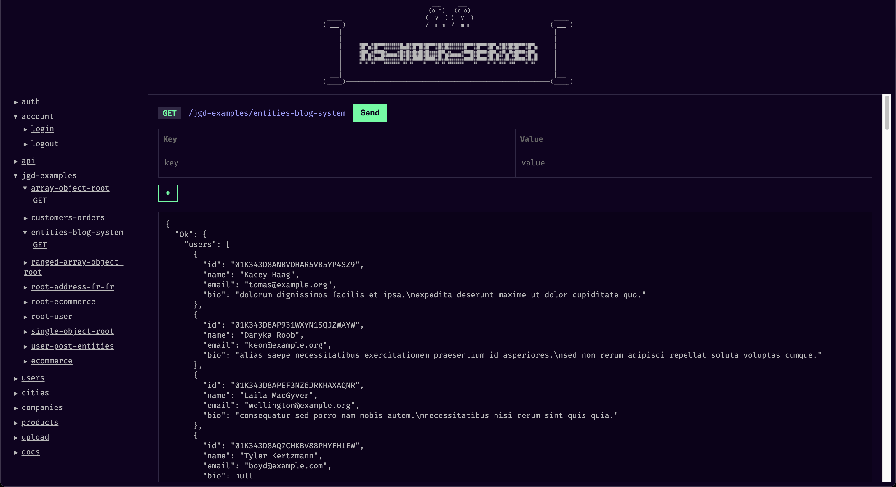

# Web Interface

Interactive testing interface at root URL for testing your mock API endpoints directly from the browser.

## Overview

rs-mock-server includes a built-in web interface that provides an interactive way to test your mock API endpoints. Access it by navigating to your server's root URL in any web browser.

## Accessing the Interface

### Default Access

**URL:** `http://localhost:4520/`

The web interface is automatically available when you start rs-mock-server. No additional configuration required.

## Features

-   **Endpoint Navigation**: Browse all available endpoints from the sidebar
-   **Interactive Testing**: Test endpoints directly with custom headers and body data
-   **Request Builder**: Build HTTP requests with method selection, headers, and body content
-   **Response Display**: View formatted responses with syntax highlighting
-   **File Upload Testing**: Test file upload endpoints with drag-and-drop interface

## How It Works

The web interface provides a terminal-style interface where you can:

1. **Browse Endpoints**: The sidebar shows all available routes from your mock files
2. **Select Method**: Choose HTTP method (GET, POST, PUT, DELETE, etc.)
3. **Add Headers**: Include custom headers like Authorization, Content-Type, etc.
4. **Add Body Data**: For POST/PUT requests, add JSON body or form data
5. **Send Request**: Execute the request and see the response
6. **Upload Files**: Test file upload endpoints with built-in file picker

## Usage Examples

### Testing a GET Endpoint

1. Click on a GET endpoint from the sidebar (e.g., `/users`)
2. Optionally add headers
3. Click "Send Request"
4. View the JSON response

### Testing a POST Endpoint

1. Click on a POST endpoint (e.g., `/users`)
2. Add Content-Type header: `application/json`
3. Add JSON body data
4. Click "Send Request"
5. View the response

### Testing File Uploads

1. Click on an upload endpoint (e.g., `/upload`)
2. Select files using the file picker
3. Click "Send Request"
4. View upload confirmation

## Integration with Other Features

The web interface automatically supports all rs-mock-server features:

-   **Authentication**: Login/logout through the interface
-   **File Uploads**: Drag-and-drop file upload testing
-   **REST APIs**: Full CRUD testing for REST endpoints
-   **Static Files**: Direct access to static assets
-   **JGD Files**: Test dynamic JSON generation endpoints

## Hot Reload Support

The web interface works seamlessly with hot reload:

1. Make changes to your mock files
2. Server automatically reloads
3. Refresh the browser to see updated endpoints
4. Test your changes immediately

## Next Steps

-   Learn about [Authentication](03-authentication.md) for testing protected endpoints
-   Explore [File Uploads](04-file-uploads.md) for testing file upload functionality
-   Try [REST APIs](02-rest-apis.md) for testing CRUD operations
-   See [Basic Routing](01-basic-routing.md) for creating endpoints to test
